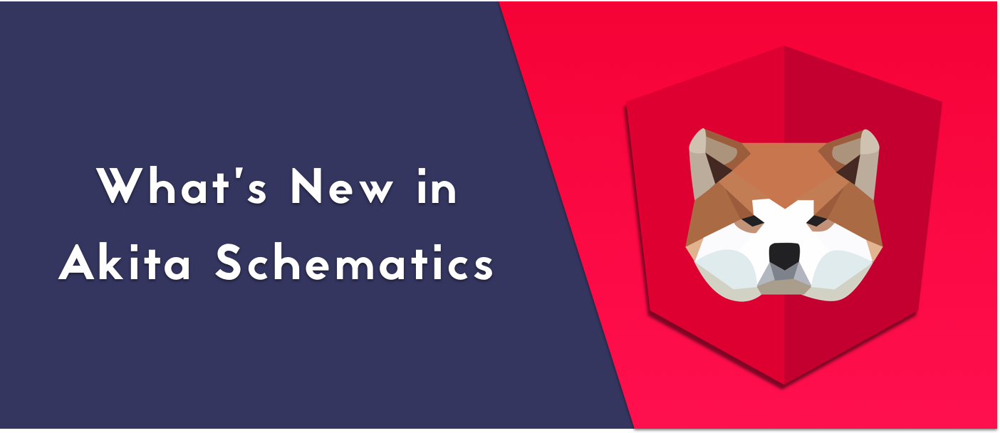
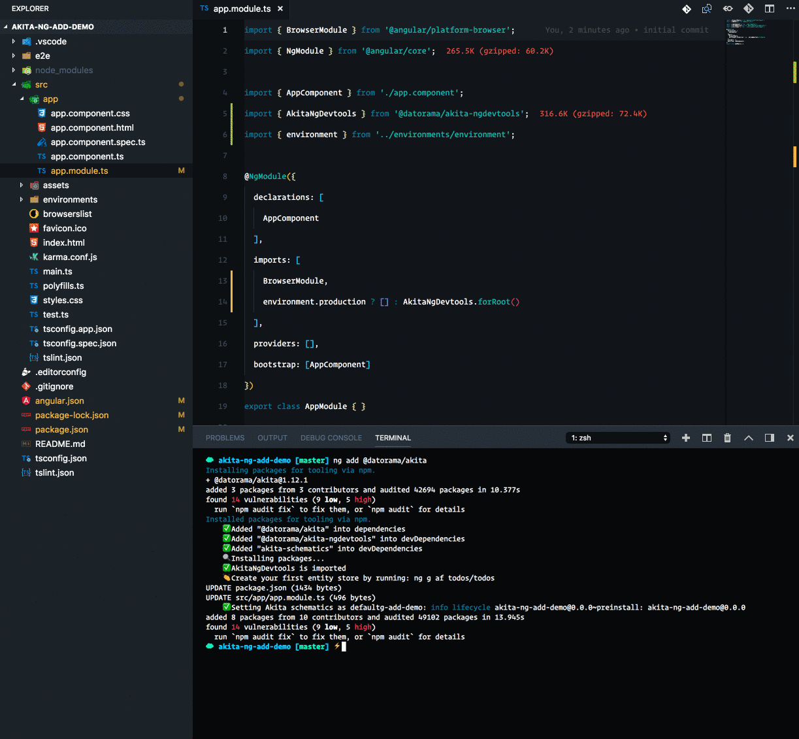
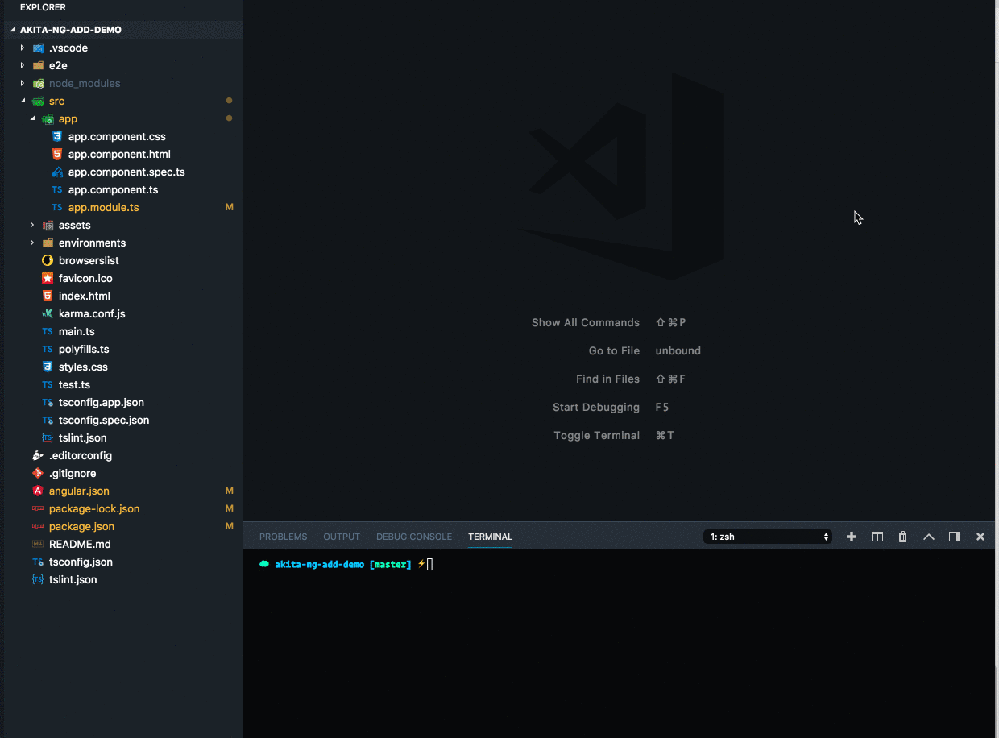

It’s now easier than ever to add Akita to an Angular project. A single command, and you’ll have the core library, schematics, Akita’s dev-tools, and the router store at your disposal. Just run:

```
ng add @datorama/akita 
```

And you’re done!



You can include the router store by adding the `withRouter` flag.

### A New Flag

In addition, when you generate a new **entity** feature, you can also tell Akita to create a module and a component giving you everything you need.



### New Gitter Channel

We opened a Gitter channel for Akita where you can ask questions or just say hello.

[**akita-state-management/Lobby**  
_Where developers come to talk._gitter.im](https://gitter.im/akita-state-management/Lobby "https://gitter.im/akita-state-management/Lobby")[](https://gitter.im/akita-state-management/Lobby)
