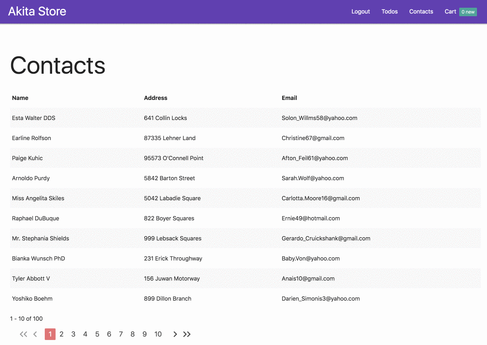
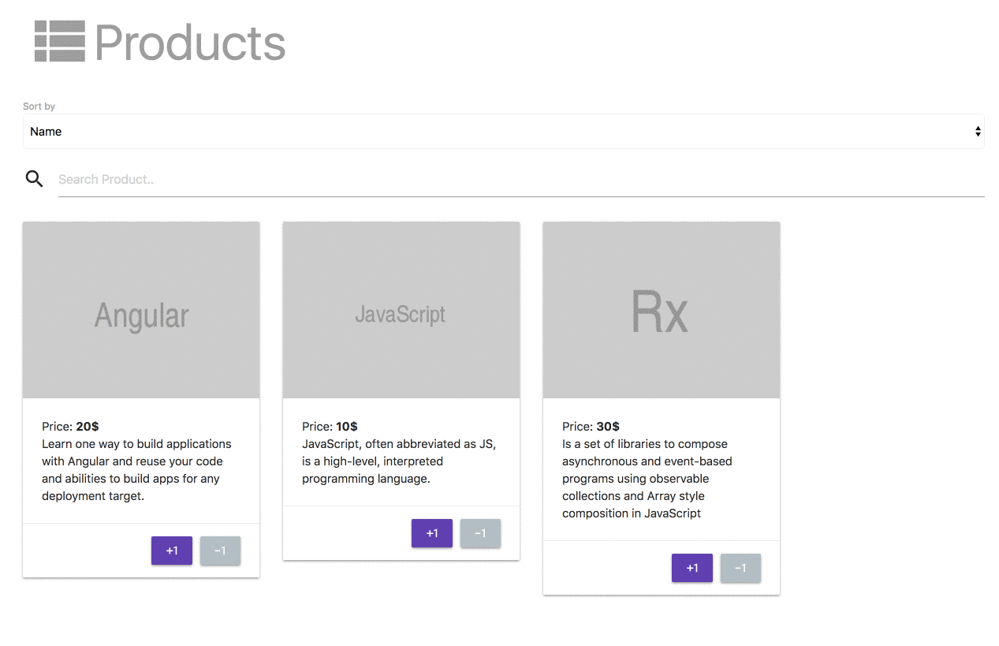
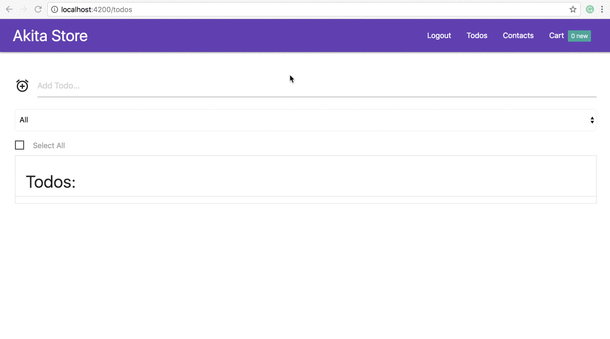

It’s only been two weeks since Akita’s [initial announcement](https://netbasal.com/introducing-akita-a-new-state-management-pattern-for-angular-applications-f2f0fab5a8), and the response has been tremendous. We want to thank everybody who’s approached us, either publicly or personally, with feedback.

We received many requests for new features, and as a result we had to add a new requirement; From now on, we’re asking to define a unique name for each store, so we can identify it.

Here is how to do it:

<Embed src="https://gist.github.com/NetanelBasal/6b1e566c6c0841b451030ca1b9f767a9.js" aspectRatio={0.357} caption="widgets.store.ts" />

We have new `StoreConfig` decorator that takes the store name and optional `[idKey](https://netbasal.gitbook.io/akita/entity-store/entity-store/entity-id)`. It’s important to mention that this is NOT a breaking change.

Now, let’s go over ④ new features.

### 💪 Server Side Pagination

In many cases — for example, when working with very large data-sets — we don’t want to work with the full collection in memory. Instead, server-side paging is used, where the server sends just a single page at a time.

Usually, we also want to cache pages that already have been fetched, in order to spare the need for an additional request.

The Paginator API provides two useful features:

1.  Caching of pages which have already been fetched.
2.  A pagination functionally, which gives you all the things you need to manage pagination in the application.

Let’s see an example of basic pagination.

First, we need to create a new **provider**, let’s say we need paginator for our contacts page:

<Embed src="https://gist.github.com/NetanelBasal/06b9b773486dab4503ff543154a8f814.js" aspectRatio={0.357} caption="contacts.pagination.ts" />

You should already be familiar with the above code. This is the regular process of creating a factory provider in Angular. We are creating a new `Paginator()`, passing the query we want to use in our pagination.

We call `withControls()`, which will give us an array of pages so we can `*ngFor` on them and `withRange()` which will give us the `from` and `to` values to display to the user.

Now, we can use it in our component:

<Embed src="https://gist.github.com/NetanelBasal/417931023f486df96df49b4e9954d9b7.js" aspectRatio={0.357} caption="contacts.component.ts" />

Paginator provides you with a `pageChanges` observable so you can listen to page changes and call the `getPage()` method, passing the request. Paginator expects to get the following **fields** as part of the response from the server:

<Embed src="https://gist.github.com/NetanelBasal/86fbb16c66ff6fb2f31160d2515f3958.js" aspectRatio={0.357} caption="response.json" />

Paginator also exposes all the data that you need to display as well as methods for controlling the page from the UI:

<Embed src="https://gist.github.com/NetanelBasal/d87f2eda2c1d5e64392c69a488f9fcda.js" aspectRatio={0.357} caption="contacts.component.html" />

That’s all you need in order to get fully working pagination including caching.

> If you don’t want Paginator to be a singleton you can skip the provider part and just create new instance directly in the component.

For a more advanced example with filters, sorting, etc. check out the [docs](https://netbasal.gitbook.io/akita/plugins/server-side-pagination).

### 😎 Sorting

By default, the store returns entities in the order in which they arrived from the server. The entities you add are pushed to the end of the collection.

You may prefer getting the entities from the store in some other order. You can provide a `sortBy` option which could be based on an entity key or a comparer function.

Akita will keep the collection in the order prescribed by your key or comparer.

You can set it once for the entire Query:

<Embed src="https://gist.github.com/NetanelBasal/0f19616cc14f61f0a4bce2c6b35a279c.js" aspectRatio={0.357} caption="" />

Or you can set it dynamically per `selectAll()`:

<Embed src="https://gist.github.com/NetanelBasal/a4a474e4c0a0fea9dce1f95aa779e4f0.js" aspectRatio={0.357} caption="contacts-sort.component.ts" />

### 👨‍🏭 Snapshot Manager

There are times when saving the local state in the server becomes useful. For example, you may want to give the user a PDF representing their local state.

For such cases, Akita provides the `snapshotManager` API.

To get a snapshot of the whole application state, you can call the `getStoresSnapshot()` method:

<Embed src="https://gist.github.com/NetanelBasal/de7d6d393799144b0f1e718943b45ebd.js" aspectRatio={0.357} caption="app.service.ts" />

The `getStoresSnapshot()` returns an object containing the whole application state. For example:

<Embed src="https://gist.github.com/NetanelBasal/6e2d9c0db1a65a5efada74b68521404a.js" aspectRatio={0.357} caption="app-state.json" />

> _The whole state is defined by the state of every Akita store in your application_

If you don’t need the whole application state, you can pass the specific stores that you need:

<Embed src="https://gist.github.com/NetanelBasal/a7793146b6b32af9a336b306178d24e3.js" aspectRatio={0.357} caption="app.service.ts" />

it also works the other way around, when you get the snapshot from the server you can save it by calling the `setStoresSnapshot()` method and passing the snapshot:

<Embed src="https://gist.github.com/NetanelBasal/437b29fb9db07726b62cedb5fe9143f3.js" aspectRatio={0.357} caption="app.service.ts" />

### 👻 Persist State

The `persistState()` function gives you the ability to persist some of the app’s state, by saving it to localStorage/sessionStorage or anything that implements the StorageEngine API, and restore it after a refresh.

To use it you should call the `persistState()` function in the `main.ts` file:

<Embed src="https://gist.github.com/NetanelBasal/b05f42bc04892a7b7e74df96a944aefd.js" aspectRatio={0.357} caption="" />

Among other options, you can also pass a whitelist or blacklist. Checkout the [docs](https://netbasal.gitbook.io/akita/plugins/persist-state) for more information.

### 👉 What’s Next

We’re working on the features that are next on the most requested list, starting with undo-redo functionality, and followed by dev-tools. We’ll also soon release new blog posts with advanced material. Stay tuned.

[**datorama/akita**  
_akita - 🚀 Simple and Effective State Management for Angular Applications_github.com](https://github.com/datorama/akita "https://github.com/datorama/akita")
