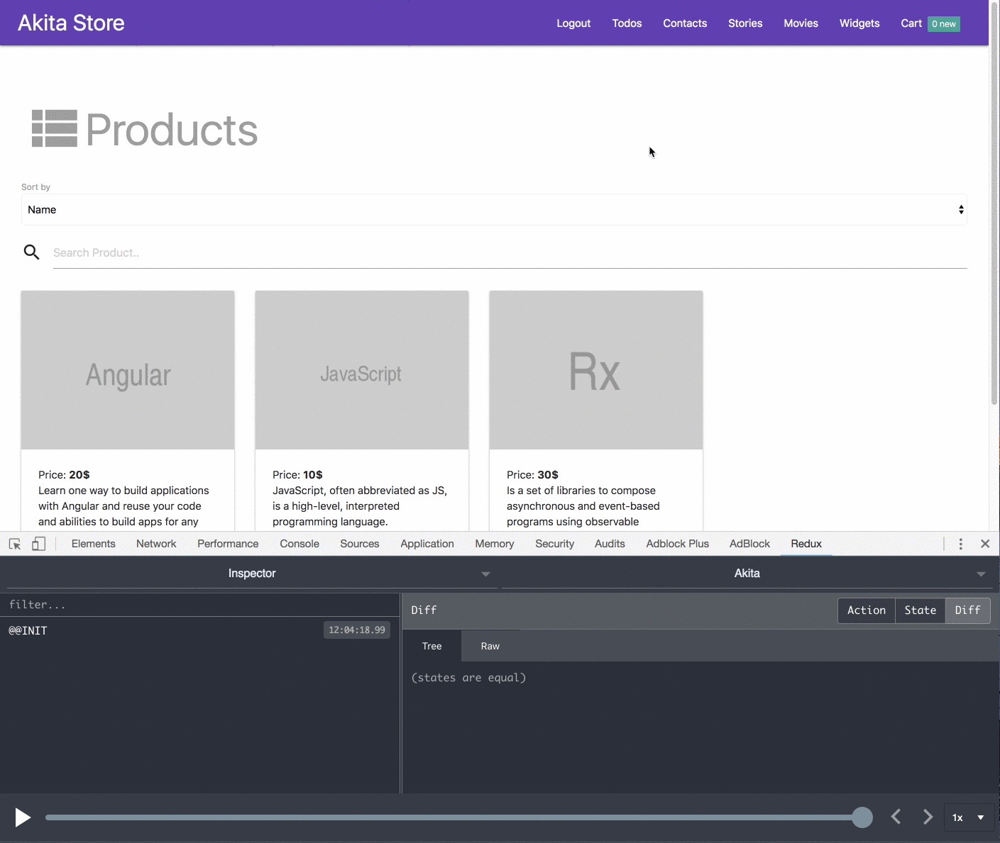
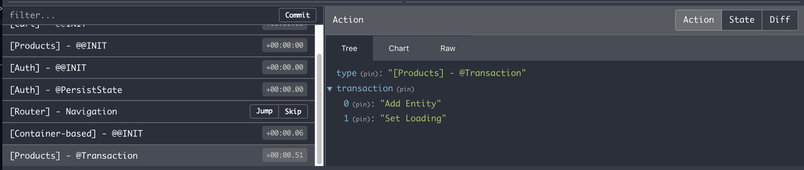
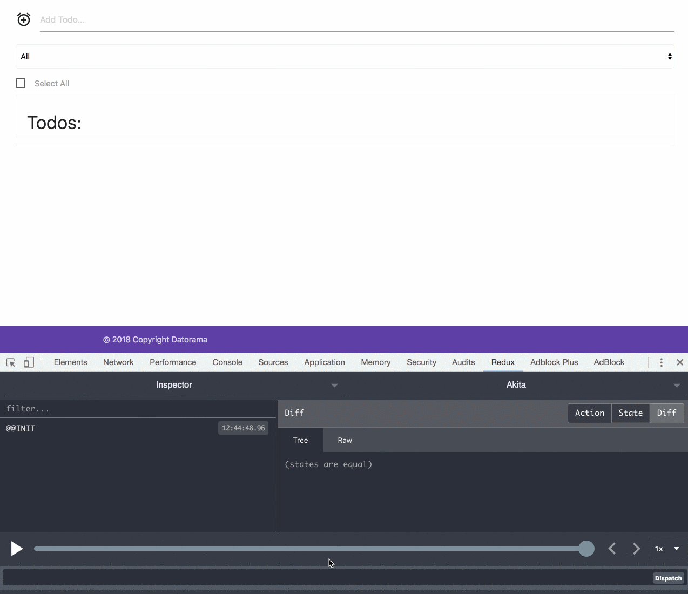

Akita has reached v1.9, and it’s time to summarize the new features we’ve added.

### 🔥 DevTool Awesomeness

We’ve added integration between Akita and the Angular router. Akita keeps track of the router state, which makes ‘time travel’ with the redux dev-tools possible.

To get started, install the `@datorama/akita-ng-router-store` package and add it and the Akita dev-tools module to the app module.

<Embed src="https://gist.github.com/NetanelBasal/b8603a493447bab06d169b71d22c6699.js" aspectRatio={0.357} caption="" />

Courtesy of [Shahar Kazaz](https://medium.com/@shahar.kazaz) and [Filip Juncu](https://medium.com/@philljuncu).

---

[Transactions](https://netbasal.gitbook.io/akita/general/transactions) are an optimization for performing multiple operations on the store. Now you can see precisely which actions were executed by inspecting the transaction in the `Action` tab.

---

**Live updates are here!** From now on we can run any store operation straight from the redux dev-tools command line. Neat!

### 💪 CRUD Add-ons

The `update()` and `remove()` methods of the entity store now accept a predicate function. For example:

<Embed src="https://gist.github.com/NetanelBasal/d000aae0ae0f377f7ec6dd917d824ce6.js" aspectRatio={0.357} caption="" />

Courtesy of [Dmitry Efimenko](https://medium.com/@dmitrief).

---

The `update()` method of the basic store now accept a callback function:

<Embed src="https://gist.github.com/NetanelBasal/c98d03eb8f6fa927e5b12a8bc57dc48b.js" aspectRatio={0.357} caption="" />

---

`setLoading()`, `setError()`, `selectLoading()` and `selectError()` which previously only worked with the entity store, now also work with the basic store. For example:

<Embed src="https://gist.github.com/NetanelBasal/279dc50d1383fb4e8d7f66a66d75c11a.js" aspectRatio={0.357} caption="" />

### 😇 Query Improvements

You can now subscribe to the whole state just by calling the query `select()` method without passing a callback function. For example:

<Embed src="https://gist.github.com/NetanelBasal/c8b24d5fbe65253bb3bad1b534b36f4b.js" aspectRatio={0.357} caption="" />

---

The query `[sortBy](https://netbasal.gitbook.io/akita/entity-store/entity-query/sort-by)` function now passes the whole state as the third argument, give you the ability to return a different `sortBy` function based on your current state. For example:

<Embed src="https://gist.github.com/NetanelBasal/ad27e985816761fdb1f5824099d7ee36.js" aspectRatio={0.357} caption="" />

Courtesy of [Dmitry Efimenko](https://medium.com/@dmitrief).

### 💎 Plugins Improvements

The [**Persist Form plugin**](https://netbasal.gitbook.io/akita/angular-plugins/persist-form) can take a specific store’s state key and sync it to a form. For example:

<Embed src="https://gist.github.com/NetanelBasal/35d25b0aa71c06b7c604e300130cd77d.js" aspectRatio={0.357} caption="" />

---

We’ve added the `ignoreNext()` method to the [**State History plugin**](https://netbasal.gitbook.io/akita/plugins/state-history), which will tell it to ignore the next store’s update call. You should call it before updating the store.

---

The [**Persist State plugin**](https://netbasal.gitbook.io/akita/enhancers/persist-state) now can take a specific key, which will sync with the provided storage. For example:

<Embed src="https://gist.github.com/NetanelBasal/2866bc6a4df525a9dd6bcead28e727c2.js" aspectRatio={0.357} caption="" />

---

We’ve added a watch property option to the [DirtyCheckPlugin](https://netbasal.gitbook.io/akita/plugins/dirty-check). For example:

<Embed src="https://gist.github.com/NetanelBasal/78819647d954250ed32a6c84593f11f3.js" aspectRatio={0.357} caption="" />

Sometimes it’s also useful to check whether at least one of the entities is dirty. For this you can use the [EntityDirtyCheckPlugin](https://netbasal.gitbook.io/akita/plugins/dirty-check)’s `someDirty()` method.

Courtesy of [Shahar Kazaz](https://medium.com/@shahar.kazaz).

### 🙏 Store Utils

We’ve added a couple of store [utils](https://netbasal.gitbook.io/akita/general/additional-functionality/store-utils).

Generate a unique id:

<Embed src="https://gist.github.com/NetanelBasal/aa4e666a8fb05526188823e4d850a8bf.js" aspectRatio={0.357} caption="" />

Increment and decrement helpers:

<Embed src="https://gist.github.com/NetanelBasal/87d9af3a146bd2cfd375f5d8ac4a009a.js" aspectRatio={0.357} caption="" />

Toggle an item’s presence in an array:

<Embed src="https://gist.github.com/NetanelBasal/fdd2d580a6a30ee14b88bf456f862b57.js" aspectRatio={0.357} caption="" />

### 📚 New Blog Posts

We’ve added many [articles](https://netbasal.gitbook.io/akita/general/blog-posts) on various subjects, make sure to check them out. Thanks to [Ido Glikman](https://medium.com/@ido.glikman), [Shahar Kazaz](https://medium.com/@shahar.kazaz), [Yonathan Meguira](https://medium.com/@johnmeguira) and [Inbal Sinai](https://medium.com/@inbalsinai).

As always, we would ❤️ to hear more feedback and new feature requests from you.

### ⚡️ Last Tips

Use [ngx-take-until-destroy](https://github.com/NetanelBasal/ngx-take-until-destroy) — A declarative way to unsubscribe from observables when the component destroyed. For example:

<Embed src="https://gist.github.com/NetanelBasal/cec786c2835633c5e68fa3adfca0cb80.js" aspectRatio={0.357} caption="" />

---

You can use [immer](https://github.com/mweststrate/immer) with Akita. Immer creates the next immutable state tree by simply modifying the current tree. For example:

<Embed src="https://gist.github.com/NetanelBasal/faf04e09f4dd17a70b3a54801a54f459.js" aspectRatio={0.357} caption="" />

### 👉🏻 New Angular Meetup in Tel-Aviv

We’ll be hosting a meet-up entitled “Kickass Angular” where we’ll be showcasing the cutting edge technologies we use/have come up with. You’re welcome to join us if you’re in town 😀

Signup and reserve a seat! 👇🏻

[**Kickass Angular**  
_18:00 - 18:30 Bring an appetite - we'll bring the pizzas. --------------------------------------- 18:30 - 19:00…_www.meetup.com](https://www.meetup.com/Datorama/events/253969284/ "https://www.meetup.com/Datorama/events/253969284/")
