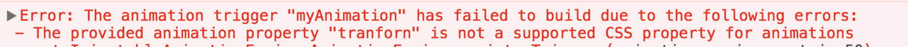
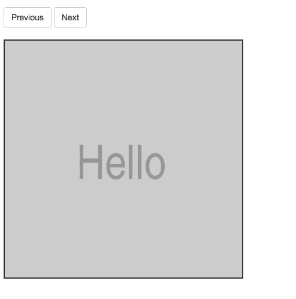

Angular version 5 is here and with her a new wave of features. In this article, I want to explore what’s new in animations.

### Negative limits in query

Animation queries now support negative limits, in which case will be matching elements from the **end** rather than from the beginning.

For Example:

```
animations: [
  trigger(
    'query', [
      transition(
        '* => start', [
          query('.item', [style({
            opacity: 0
          }), animate('2s', style({
            opacity: 1
          }))], {
            limit: -3
          }),
        ]),
    ]),
]
```

<Embed src="https://stackblitz.com/edit/angular5-limit?embed=1" aspectRatio={undefined} caption="" />

### Improved disabled property

The `@.disabled` property now work without an expression. When the expression is missing it will treat the `property` as true.

For example:

```
// Animation will be disabled
<div @.disabled>
  <div [@animate]="expression">Animate</div>
</div>
```

### Better error handling

Angular now throws an error when invalid CSS property is used in the animation.

For example:

```
style({opacity: 0, tranforn: 'translateX(0)'})
```

Will throw:



### New aliases

Support for `:increment` and `:decrement` transition aliases. In addition to the `:enter` and `:leave` transition aliases, the `:increment` and `:decrement` aliases can be used to kick off a transition when a numeric value has increased or decreased in value.

For example:

```
animations: [
  trigger('slider', [
    transition(":increment", group([
      query(':enter', [
        style({
          left: '100%'
        }),
        animate('0.5s ease-out', style('*'))
      ]),
      query(':leave', [
        animate('0.5s ease-out', style({
          left: '-100%'
        }))
      ])
    ])),
    transition(":decrement", group([
      query(':enter', [
        style({
          left: '-100%'
        }),
        animate('0.5s ease-out', style('*'))
      ]),
      query(':leave', [
        animate('0.5s ease-out', style({
          left: '100%'
        }))
      ])
    ]))
  ])
]
```

<Embed src="https://stackblitz.com/edit/angular5-slider?embed=1" aspectRatio={undefined} caption="" />

_Follow me on_ [_Medium_](https://medium.com/@NetanelBasal/) _or_ [_Twitter_](https://twitter.com/NetanelBasal) _to read more about Angular, Vue and JS!_
