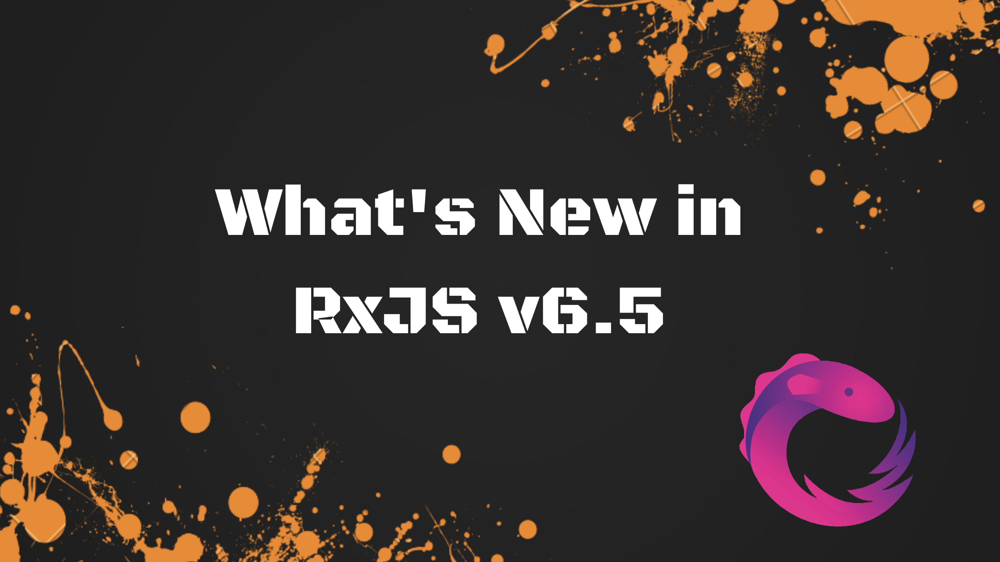

RxJS version [6.5.0](https://github.com/ReactiveX/rxjs/blob/master/CHANGELOG.md#650-2019-04-23) is now available. This post highlights the latest features and improvements in this version.

### New Fetch Observable

RxJS now provides built-in support for using the native JS [fetch](https://developer.mozilla.org/en-US/docs/Web/API/Fetch_API) API, including the ability to abort requests with `[AbortController](https://developer.mozilla.org/en-US/docs/Web/API/AbortController)` baked-in.

<Embed src="https://gist.github.com/NetanelBasal/ff8222b8be857ab73526898301d37a72.js" aspectRatio={0.357} caption="" />

<Embed src="https://stackblitz.com/edit/fromfetch?embed=1" aspectRatio={undefined} caption="" />

### forkJoin Improvements

This is one of my favorites. The `forkJoin` observable now takes a dictionary of sources:

<Embed src="https://gist.github.com/NetanelBasal/ff38a46458a6f97c1f867ef02283ab6e.js" aspectRatio={0.357} caption="" />

Moreover, there is one deprecation — `forkJoin(a, b, c, d)` should no longer be used; Instead, pass an array such as `forkJoin([a, b, c, d])`.

<Embed src="https://gist.github.com/NetanelBasal/23c569c39dc95f46608ea60a7a178ee2.js" aspectRatio={0.357} caption="" />

<Embed src="https://stackblitz.com/edit/forkjoin-65?embed=1" aspectRatio={undefined} caption="" />

### Partition Observable

The current `partition` operator is deprecated in favor of a new creation observable, named `partition`.

The [partition](https://netbasal.com/rxjs-eight-operators-worth-getting-to-know-2b6c18e601d) observable splits the source observable into two observables, one for values which satisfy the given predicate, and the other for values which don’t.

<Embed src="https://gist.github.com/NetanelBasal/83fa868fbec80a6f6d55c19b2b16510d.js" aspectRatio={0.357} caption="" />

<Embed src="https://stackblitz.com/edit/partition-65?embed=1" aspectRatio={undefined} caption="" />

### combineLatest Deprecation

This version deprecates all `combineLatest` signatures except `combineLatest([a, b, c])` . You can read the reason for this change [here](https://github.com/reactivex/rxjs/commit/6661c79).

### Schedulers

Add the `scheduled` creation function to create a scheduled observable of values. The scheduled versions of `from`, `range`, et al. have been deprecated.

<Embed src="https://gist.github.com/NetanelBasal/c6f5b6d1bf40dbd7b5afd6a747eb06c9.js" aspectRatio={0.357} caption="" />

<Embed src="https://stackblitz.com/edit/scheduled65?embed=1" aspectRatio={undefined} caption="" />

_Follow me on_ [_Medium_](https://medium.com/@NetanelBasal/) _or_ [_Twitter_](https://twitter.com/NetanelBasal) _to read more about Angular, Akita and JS!_

### Additional Resources

[**RxJS — Six Operators That you Must Know**  
_1\. Concat —_netbasal.com](https://netbasal.com/rxjs-six-operators-that-you-must-know-5ed3b6e238a0 "https://netbasal.com/rxjs-six-operators-that-you-must-know-5ed3b6e238a0")

[**RxJS: Eight Operators Worth Getting to Know**  
_\# mapTo_netbasal.com](https://netbasal.com/rxjs-eight-operators-worth-getting-to-know-2b6c18e601d "https://netbasal.com/rxjs-eight-operators-worth-getting-to-know-2b6c18e601d")

[**Understanding mergeMap and switchMap in RxJS**  
_Higher order observables are one of the most influential features in Rx. They’re also one of the most difficult to…_netbasal.com](https://netbasal.com/understanding-mergemap-and-switchmap-in-rxjs-13cf9c57c885 "https://netbasal.com/understanding-mergemap-and-switchmap-in-rxjs-13cf9c57c885")

[**👻 Who’s Afraid of Observables?**  
_In this article, we’ll create a simple implementation of the observable pattern and work to understand the core…_netbasal.com](https://netbasal.com/whos-afraid-of-observables-bde0dc4f48cc "https://netbasal.com/whos-afraid-of-observables-bde0dc4f48cc")

[**RxJS Subjects for human beings**  
_I have already published an article on the subject, but this time I want to take a different approach._netbasal.com](https://netbasal.com/rxjs-subjects-for-human-beings-7807818d4e4d "https://netbasal.com/rxjs-subjects-for-human-beings-7807818d4e4d")

[**Understanding Subjects in RxJS**  
_Before we start, this article requires basic knowledge in Rx._netbasal.com](https://netbasal.com/understanding-subjects-in-rxjs-55102a190f3 "https://netbasal.com/understanding-subjects-in-rxjs-55102a190f3")

### 😱  🚀 **Have You Tried Akita Yet?**

One of the leading state management libraries, Akita has been used in countless production environments. It’s constantly developing and improving.

Whether it’s entities arriving from the server or UI state data, Akita has custom-built stores, powerful tools, and tailor-made plugins, which help you manage the data and negate the need for massive amounts of boilerplate code. We/I highly recommend you try it out.

[**🚀 Introducing Akita: A New State Management Pattern for Angular Applications**  
_Every developer knows state management is difficult. Continuously keeping track of what has been updated, why, and…_netbasal.com](https://netbasal.com/introducing-akita-a-new-state-management-pattern-for-angular-applications-f2f0fab5a8 "https://netbasal.com/introducing-akita-a-new-state-management-pattern-for-angular-applications-f2f0fab5a8")
