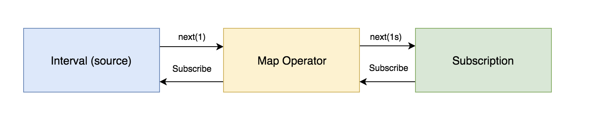

In this article, we’ll create a simple implementation of the observable pattern and work to understand the core concepts behind it.

### The Observer pattern:

> The observer pattern is a software design pattern in which an object, called the subject, maintains a list of its dependents, called observers, and automatically notifies them of any state changes (usually by calling one of their methods). (Wikipedia)

The observable object represents a push-based collection. Observables are just what you’d imagine — things you wish to observe and take action on.

The observable object class sends notifications, while the observer object class receives them.

Let’s start by defining the observable class.

<Embed src="https://gist.github.com/NetanelBasal/1519c14e1f32bb10c72f8ce415e08126.js" aspectRatio={0.357} caption="" />

The `Observable` class considers one parameter — a subscription function. The `subscription` function is named as such because this is the function that invokes our observable when someone calls `subscribe()`.

Sometimes people refer to the subscription function as the “producer” function, because this function also produces the values for the observer.

Let’s create a new instance of our `Observable`.

<Embed src="https://gist.github.com/NetanelBasal/eabfc405caf8939a9d5cc940c28924eb.js" aspectRatio={0.357} caption="" />

A subscription function receives an observer. An observer is simply a plain object with three optional methods: `next()`, `error()`, `and complete()`.

-   `next()` : Call this method when you have a new value.
-   `error()`: Call this method on error.
-   `complete():` Call this method on complete.

As you can imagine, in this phase we still don’t invoke anything. Observables are **lazy** — nothing executes until we call `subscribe()`. (in case of cold observables)

Let’s create the `subscribe()` method.

<Embed src="https://gist.github.com/NetanelBasal/50d40c8b2b4e6746a1dd9706550bd9a1.js" aspectRatio={0.357} caption="" />

The `subscribe()` method takes an `observer` and calls the `subscription` function with it. Note that each call to `subscribe()` invokes the subscription function **again**.

Let’s continue by creating an `interval` observable.

<Embed src="https://gist.github.com/NetanelBasal/b6f02574a9bbf8e580649cf542f18498.js" aspectRatio={0.357} caption="" />

When we subscribe to the `interval` observable we are invoking the `subscription` function, that executes the native JS `setInterval()` function and notifies the observer each time it’s invoked.

But that’s not enough. We should also be able to “stop” the subscription function. Each observable should return the `unsubscribe()` method responsible for cleaning.

<Embed src="https://gist.github.com/NetanelBasal/31f95e3a525f7ef44bf0ad5bbe34a020.js" aspectRatio={0.357} caption="" />

The `unsubscribe()` method of our interval stops the interval by calling `clearInterval()` with the provided ID.

### Operators

Operators are observables that operate on a source observable. Let’s create the `map()` operator.

<Embed src="https://gist.github.com/NetanelBasal/2fac67abbf4577f3442b26517c9d03ed.js" aspectRatio={0.357} caption="" />

Now, let’s see how we can use this operator with our `interval` observable.

<Embed src="https://gist.github.com/NetanelBasal/195f4e7e04f67885633e28c7364163bd.js" aspectRatio={0.357} caption="" />

The `map()` operator returns a new `Observable` that subscribes to the source — in our case, the `interval` observable.

When the source emits a new value, the value first gets to the `map()` subscription function. Then, **after** applying the projection function on the value, the `map()` observable emits the value to the final subscription.

This is called the Observable chain.

Let’s continue with the `filter` operator.

<Embed src="https://gist.github.com/NetanelBasal/d402985ebfbc1e6672b650009d91c85a.js" aspectRatio={0.357} caption="" />

The `filter` operator filters the source values by only allowing items through that pass a test that you specify in the form of a predicate function.

Let’s finish with the `mergeMap` operator. The `mergeMap` operator is handy for cases when you have an observable that returns an observable. Let’s create the `of` observable so we can put it into practice.

<Embed src="https://gist.github.com/NetanelBasal/dd71514ec0d733bac4c96ec79fad311c.js" aspectRatio={0.357} caption="" />

The `of` observable converts arguments to an observable sequence. Let’s use it with our `interval`.

<Embed src="https://gist.github.com/NetanelBasal/883f4fefe492fa379f4bd9494b427f7d.js" aspectRatio={0.357} caption="" />

Each time the source emits a value, we need to subscribe to the inner observable (the `of` observable) and emits its values back to the pipeline.

<Embed src="https://gist.github.com/NetanelBasal/a89262b4c6f938619430328996609eae.js" aspectRatio={0.357} caption="" />

That’s why it’s called `mergeMap`; we are performing both a map operation and a merge operation at once.

These are the essential components of observables and operators. After learning these basics, you can continue on to learn about more advanced parts:

[**Hot vs Cold Observables**  
_TL;DR: You want a HOT observable when you don’t want to create your producer over and over again._medium.com](https://medium.com/@benlesh/hot-vs-cold-observables-f8094ed53339 "https://medium.com/@benlesh/hot-vs-cold-observables-f8094ed53339")

[**Understanding mergeMap and switchMap in RxJS**  
_Higher order observables are one of the most influential features in Rx. They’re also one of the most difficult to…_netbasal.com](https://netbasal.com/understanding-mergemap-and-switchmap-in-rxjs-13cf9c57c885 "https://netbasal.com/understanding-mergemap-and-switchmap-in-rxjs-13cf9c57c885")

[**Understanding Subjects in RxJS**  
_Before you start, this article requires basic knowledge in Rx._netbasal.com](https://netbasal.com/understanding-subjects-in-rxjs-55102a190f3 "https://netbasal.com/understanding-subjects-in-rxjs-55102a190f3")

[**RxJS Subjects for human beings**  
_I have already published an article on the subject, but this time I want to take a different approach._netbasal.com](https://netbasal.com/rxjs-subjects-for-human-beings-7807818d4e4d "https://netbasal.com/rxjs-subjects-for-human-beings-7807818d4e4d")

[**RxJS: Understanding the publish and share Operators**  
_An in-depth look at multicasting_blog.angularindepth.com](https://blog.angularindepth.com/rxjs-understanding-the-publish-and-share-operators-16ea2f446635 "https://blog.angularindepth.com/rxjs-understanding-the-publish-and-share-operators-16ea2f446635")

<Embed src="https://stackblitz.com/edit/nb-observable?embed=1" aspectRatio={undefined} caption="" />

### 👂🏻 **Last but Not Least, Have you Heard of Akita?**

Akita is a state management pattern that we’ve developed here in Datorama. It’s been successfully used in a big data production environment for over seven months, and we’re continually adding features to it.

Akita encourages simplicity. It saves you the hassle of creating boilerplate code and offers powerful tools with a moderate learning curve, suitable for both experienced and inexperienced developers alike.

I highly recommend checking it out.

[**🚀 Introducing Akita: A New State Management Pattern for Angular Applications**  
_Every developer knows state management is difficult. Continuously keeping track of what has been updated, why, and…_netbasal.com](https://netbasal.com/introducing-akita-a-new-state-management-pattern-for-angular-applications-f2f0fab5a8 "https://netbasal.com/introducing-akita-a-new-state-management-pattern-for-angular-applications-f2f0fab5a8")

_Follow me on_ [_Medium_](https://medium.com/@NetanelBasal/) _or_ [_Twitter_](https://twitter.com/NetanelBasal) _to read more about Angular, Akita and JS!_
