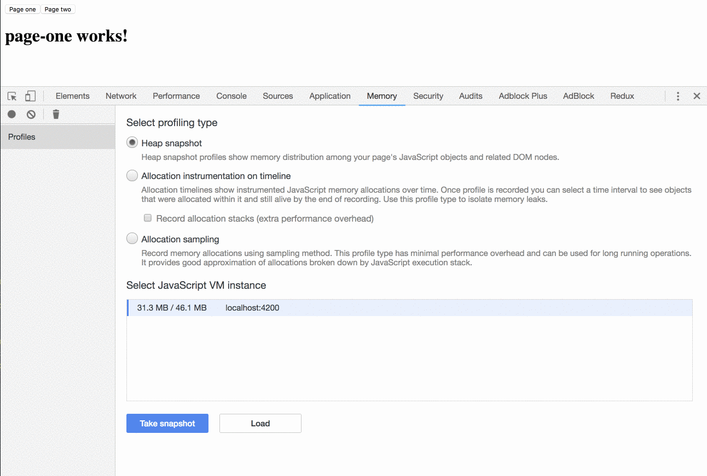
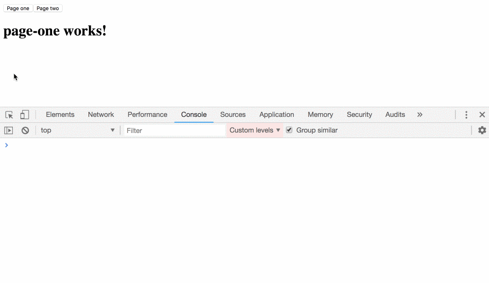
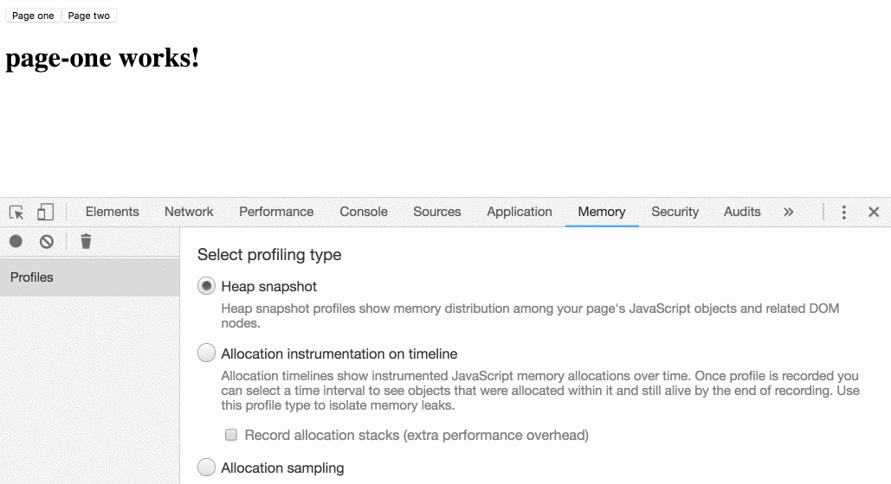

In this article, we’ll learn why it’s important to clean our subscriptions. Let’s set up a **realistic** Angular example.

First, we’ll create a simple [Akita](https://github.com/datorama/akita) store that holds one property:

<Embed src="https://gist.github.com/NetanelBasal/d840df2d8adbb25877edc96c7a200f6c.js" aspectRatio={0.357} caption="" />

Great. Now let’s create two components. The first component will listen to the `someProp` store’s key and the second component will update it.

<Embed src="https://gist.github.com/NetanelBasal/50813cb131003a68329f9994f08bf3c7.js" aspectRatio={0.357} caption="" />

### \# Problem One — Memory Leak

The subscription function **holds a reference** to `this` (the component instance) therefore the `PageOne` instance isn’t available for garbage collection and will not be collected.

Let’s view it in Chrome dev-tools:

As you can see, the component instance is still in memory even though Angular destroyed it.

### \# Problem Two — Unexpected Behaviour

Let’s say we need to call the `detectChanges()` method upon `someProp` update.

<Embed src="https://gist.github.com/NetanelBasal/f10ecba90d2821edc65a8ece5f7ed21c.js" aspectRatio={0.357} caption="" />

Now, let’s move to `PageTwoComponent`, update the store and see what’s happening.

We didn’t clean up our subscription function before Angular destroyed the component, so when we update the store, it runs and calls the `detectChanges()` method on a component that from Angular perspective is destroyed.

### The Solution

In one word — Unsubscribe 😀.

<Embed src="https://gist.github.com/NetanelBasal/bf845c5bd763918244e03a9ef0b7c0e6.js" aspectRatio={0.357} caption="" />

Let’s see that we clean the memory leak and everything is working as expected.

It’s worth mention that everything is also relevant to event emitters, intervals, timers, etc.

### 😍 **Have You Tried Akita Yet?**

One of the leading state management libraries, Akita has been used in countless production environments. It’s constantly developing and improving.

Whether it’s entities arriving from the server or UI state data, Akita has custom-built stores, powerful tools, and tailor-made plugins, which help you manage the data and negate the need for massive amounts of boilerplate code. We/I highly recommend you try it out.

[**🚀 Introducing Akita: A New State Management Pattern for Angular Applications**  
_Every developer knows state management is difficult. Continuously keeping track of what has been updated, why, and…_netbasal.com](https://netbasal.com/introducing-akita-a-new-state-management-pattern-for-angular-applications-f2f0fab5a8 "https://netbasal.com/introducing-akita-a-new-state-management-pattern-for-angular-applications-f2f0fab5a8")

[**10 Reasons Why You Should Start Using Akita as Your State Management Solution**  
_State management is ubiquitous in web applications, be they big or small. One of the notable solutions in this field is…_dev.to](https://dev.to/theblushingcrow/10-reasons-why-you-should-start-using-akita-as-your-state-management-solution-c72 "https://dev.to/theblushingcrow/10-reasons-why-you-should-start-using-akita-as-your-state-management-solution-c72")

_Follow me on_ [_Medium_](https://medium.com/@NetanelBasal/) _or_ [_Twitter_](https://twitter.com/NetanelBasal) _to read more about Angular, Akita and JS!_
