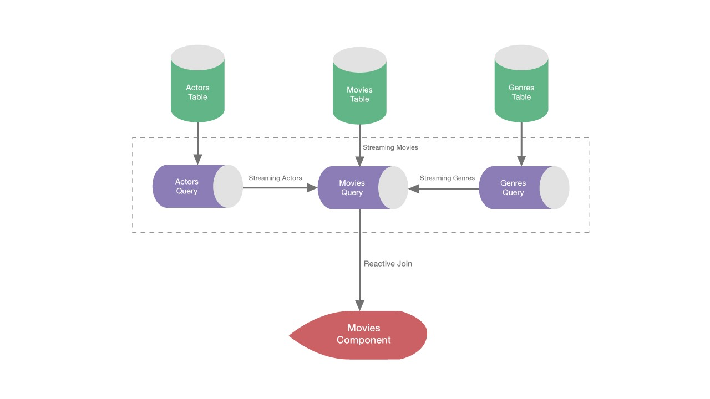

In this article, we’ll build an Angular application which lists movies which arrive from a nested API response. We’ll learn how to store and update our data more efficiently using Akita.

This post assumes that you at least have some working knowledge of Akita. If not, please start with the [basics](https://netbasal.com/introducing-akita-a-new-state-management-pattern-for-angular-applications-f2f0fab5a8).

Let’s say our server response is:

<Embed src="https://gist.github.com/NetanelBasal/1966bdc7ade7c5e56d6d5a5033f74d28.js" aspectRatio={0.357} caption="" />

A movie could have many actors and also many genres. By examining this type of response, we can observe its disadvantages.

1.  Duplicate objects (actors or genres) will increase memory consumption and make the server payload larger.
2.  Updates will be harder and can become very ugly very fast (due to the nature of nested spreads) . For example, if we want to update an actor’s name we’ll need to loop over each `movie.actors`, check if it exists and update. (the same goes for deletion).

Because of the above reasons, the recommended approach to managing relational or nested data in Akita is to treat your data as if it were in a database and keep that data in a normalized form.

### Designing a Normalized State

In Akita, normalizing data means that each entity gets its own “table,” i.e., Akita `EntityStore` and any references to individual entities should be done by storing the entities’ ID.

An example of a normalized state structure for the movies example above might look like this:

<Embed src="https://gist.github.com/NetanelBasal/82332712ab936bc010f69669ce410dd4.js" aspectRatio={0.357} caption="" />

This state structure is much flatter overall. This is an improvement upon the original nested format for several reasons:

1.  We get rid of the duplicate objects, which means our memory consumption decreases and the server payload will be smaller.
2.  We have a single source of truth for each entity which makes updating or removing an entity easier.
3.  Retrieving an entity is just a matter of a simple lookup.
4.  We can **query** only the data we need. For example, if we have a view that shows only the actors, we can query the `ActorsStore` and get only the actors without any redundant data.

The recommend option is to perform the normalization on the server-side, so you can also benefit from a smaller payload. I’ve worked in several companies which have developed a generic solution on the server-side. If that’s not possible, you can always do it yourself or leverage a tool like [normalizr](https://github.com/paularmstrong/normalizr) as we are going to do on the client-side.

### Build the Stores

First, let’s create the building blocks for each entity — store and query.

<Embed src="https://gist.github.com/NetanelBasal/f1cfda6cc2b8c039f73de142dc6ddaf4.js" aspectRatio={0.357} caption="" />

We store each entity in a separate table, i.e. store, and use query to get it.

Now, let’s create the movies component which will be responsible for displaying the movies:

<Embed src="https://gist.github.com/NetanelBasal/c9094e5e96a3d04094c81e8a85cdbd49.js" aspectRatio={0.357} caption="" />

The movies component is relatively straightforward. It queries the movies from `MoviesQuery` and calls `getMovies()` to fetch movies from the server.

Let’s examine the `getMovies()` method:

<Embed src="https://gist.github.com/NetanelBasal/38d65d10ca65ccf367648957bdd1af86.js" aspectRatio={0.357} caption="" />

As I mentioned before, in our example, we’ll use `normalizr` to flatten the server response. I’m not going to focus on `normalizr`, but here is the code for our case:

<Embed src="https://gist.github.com/NetanelBasal/75d4e36a63d326de3a89f727eb029216.js" aspectRatio={0.357} caption="" />

Providing the unflattened response that we saw in the beginning, the above code will return the following structure:

<Embed src="https://gist.github.com/NetanelBasal/82332712ab936bc010f69669ce410dd4.js" aspectRatio={0.357} caption="" />

We get the flattened response and update each store with the corresponding data. With actors and movies, we don’t worry about the order, so we call `set()` with the entities alone, letting Akita resolves the ids.

After initialized our stores, it’s time to create the final query:

<Embed src="https://gist.github.com/NetanelBasal/7648cff1d905947868deb488a9354aea.js" aspectRatio={0.357} caption="" />

That’s what I like to call a _reactive join_. We are querying the data from each query, mapping each id to its corresponding entity.

Let’s stop for a second and explain an important concept.

The `combineLatest()` observable will invoke the `map()` projection function whenever any of the selectors (movies, actors, genres) fires. In our case, each time we get a new response from the server, it’ll trigger all three, which leads to redundant executions.

To optimize this behavior, we can use `auditTime()`. `auditTime(0)` is similar to `setTimeout(0)`; It waits for the current execution loop to complete, and only then emits the latest value.

Going back to our component, we can display the movies:

<Embed src="https://gist.github.com/NetanelBasal/c86af3f1f5e4ac194fc11f2b193ace02.js" aspectRatio={0.357} caption="" />

Now, let’s say we want to give users the ability to edit an actor’s name. The only code that we need to run is `ActorStore.update()` based on the id. For example:

<Embed src="https://gist.github.com/NetanelBasal/670603cafd970ebe172b2789982ef0af.js" aspectRatio={0.357} caption="" />

And our reactive join (`selectMovies()`) will take care of updating each subscriber with the new data.

<Embed src="https://stackblitz.com/edit/akita-movies?embed=1" aspectRatio={undefined} caption="" />

[**datorama/akita**  
_akita - 🚀 Simple and Effective State Management for Angular Applications_github.com](https://github.com/datorama/akita "https://github.com/datorama/akita")

_Follow me on_ [_Medium_](https://medium.com/@NetanelBasal/) _or_ [_Twitter_](https://twitter.com/NetanelBasal) _to read more about Angular, Akita and JS!_
