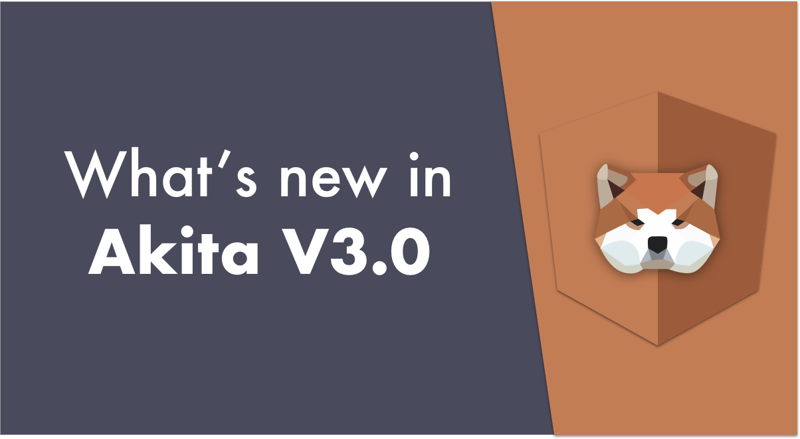
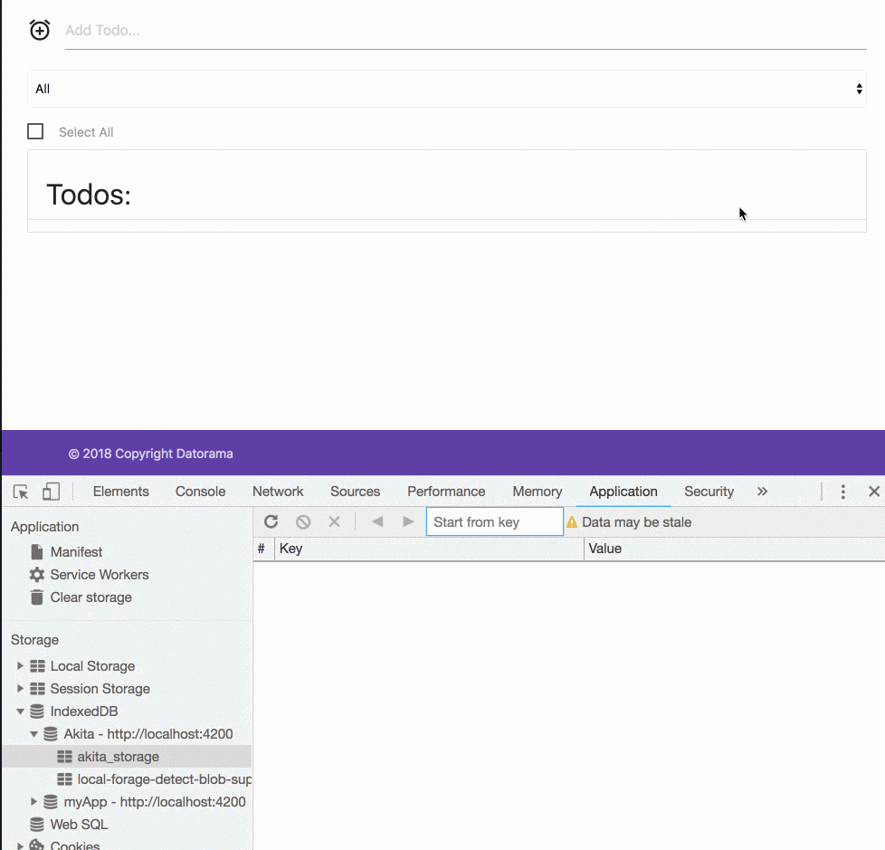

Akita 3.0 is finally here! We’ve listened to your feature requests and incorporated them in this brand new version of the popular state management library. It’s another step in our plan to help you manage your states more efficiently and with less of a hassle.

Let’s have a look at what’s new:

### 🚀 Store Middleware

It’s now possible to define middleware functions both for a `Store` and `EntityStore`. For example, in `EntityStore` we can add the following methods:

<Embed src="https://gist.github.com/NetanelBasal/752a74bfb83cd8b061967164fc266a3d.js" aspectRatio={0.357} caption="" />

The `preEntityAdd()` middleware is called when we invoke the `EntityStore.set()` or `EntityStore.add()` methods with the newly added entity, and gives you the possibility to modify it before inserting it into the store.

The `preEntityUpdate()` middleware is called with the previous entity’s data, as well as the updated version of it, whenever we call any `EntityStore` method that updates an entity, for instance, `EntityStore.update(1)` , `EntityStore.updateActive()`.

In addition to that, we’ve added the `preUpdate()` middleware that’s supported in both stores, and is called with the previous and the current state.

This middleware is called whenever we call `Store.update()`. For example:

<Embed src="https://gist.github.com/NetanelBasal/7fbd8afd0077b229a49aee66371cab16.js" aspectRatio={0.357} caption="" />

These can also be useful for debugging purposes. For example, logging who’s updating the store.

### 🤯 Event-based APIs Support

One of the recurring requests we got, was to simplify and improve the experience of working with event-based APIs such as web-sockets.

To make it easier for you, we’ve added a new API method — `runStoreAction`:

<Embed src="https://gist.github.com/NetanelBasal/ce5afac621cca5c9e42102b0b4799218.js" aspectRatio={0.357} caption="" />

The `runStoreAction()` takes the store’s name, an action and a payload, and updates the store based on that information. So now, for example, you can get these parameters from your socket connection and update any store you want.

### 🤩 Query Improvements

We’ve added the ability to pass a **string** to the `Query.select()` and `EntityQuery.selectEntity()` methods, which is the state slice we want to grab. For example:

<Embed src="https://gist.github.com/NetanelBasal/dab2ada1beda3e8707777e034f7f070a.js" aspectRatio={0.357} caption="" />

This parameter is typed according to the state/entity interface, giving you intelligent code completion via Typescript.

### 🤓 Entity Array Utils

This is one of my favorite feature. Let’s say we have the following `EntityStore`:

<Embed src="https://gist.github.com/NetanelBasal/f469d1563d1c15f4c544522ea0237e7d.js" aspectRatio={0.357} caption="" />

We have an `EntityStore` which holds a collection of `articles`. Each article holds an array of `comments`. Prior to Akita v3, if we wanted to perform CRUD operations on the comments collection we needed to do all the work ourselves.

Luckily, starting from this version, Akita provides helper methods that take care of the grunt work. For example:

<Embed src="https://gist.github.com/NetanelBasal/5b18b93974931a29e4bd9fa7de02f978.js" aspectRatio={0.357} caption="" />

As in the previous feature, the first parameter is **typed,** so you’ll get intelligent code completion suggesting only keys that are typed as `Arrays`.

That takes care of the CRUD operations, but we also have some good stuff added to the `Query`; Akita now provides a special operator to query specific items from a collection. For example:

<Embed src="https://gist.github.com/NetanelBasal/9551af13ffd5b53fafd987efcbafcf72.js" aspectRatio={0.357} caption="" />

The added advantage is that these observables **will only fire if one of the items in the resulting collection has been modified**, via an update, add or delete operation.

### 🤟 New Cache Functionality

We came to the conclusion that the previous API methods, `isDirty` and `isPristine`, were confusing to users, who often didn’t see the point of using them, so we removed them in a favor of a new API.

We’ve added built-in cache support that will provide information about whether we already have data in the store. For example, in many cases we want to perform an HTTP request **only** **once**, and from that point on, to get the cached data from the store.

Now, when we call `EntityStore.set()`, Akita internally marks the store as cached. We can also manually mark the store as cached by calling the `Store.setHasCache(boolean)` method.

The way we use it is by using two new query methods — `selectHasCache()` and `getHasCache()` . For example:

<Embed src="https://gist.github.com/NetanelBasal/a769b7631232fc5c6854b7560f505d6d.js" aspectRatio={0.357} caption="" />

But that’s not all — we can also define a `ttl` (time to live) which when expires will automatically invalidate the cache for you. For example:

<Embed src="https://gist.github.com/NetanelBasal/e4ae9de5cd978a6eb69df1af81d7993b.js" aspectRatio={0.357} caption="" />

In the code above, every hour Akita invalidates the cache, which causes the `selectHasCache()` stream to fire, causing the products to be fetched again from the server.

### 🎩 Entity UI Store

Akita recommends separating the Domain State from the UI State. Domain State is the state of your application in the server side, while the UI state is information that’s relevant to the UI alone, and therefore not stored in the server.

Some examples of that are the current time based on the user’s machine, which tab is the active one, or whether a drop-down is open.

There are times when we need to have an entity-based UI state. For example, we need to know if the current entity is open or loading, etc. For such cases, we’ve added a built-in UI store and an accompanying UI query that you can create on demand.

<Embed src="https://gist.github.com/NetanelBasal/7d8724c99b3d73eb37bed9663d0afe97.js" aspectRatio={0.357} caption="" />

The only thing we need to do is to add the `ui` property, passing the entity UI interface, and call the `createUIStore()` in the store and `createUIQuery()` in the query.

With this setup, Akita will instantiate a new `EntityStore` and `EntityQuery` under the `ui` property, that will be responsible for managing the entity UI state.

If you’re working with Akita’s dev-tools, you’ll see the new store prefixed with the UI keyword.

### 🤞PersistState Async Support

We’ve add asynchronous support to the `persistState` plugin. This gives you the option to save a store’s value to a persistent storage, such as `indexedDB`, `websql`, or any other asynchronous API. Here’s a live demo that leverages [localForage](https://github.com/localForage/localForage):

Note that this feature is still experimental.

### 🦊 Working with Immer

As you know, when working with immutable objects you often get to what’s called a “spread hell” situations. If you prefer working with immutable objects in an mutable fashion, you can use [immer](https://github.com/mweststrate/immer) with Akita.

Here’s an example for a nice pattern you could leverage:

<Embed src="https://gist.github.com/NetanelBasal/983b8ae96ed6586270c7347431f0c28c.js" aspectRatio={0.357} caption="" />

<Embed src="https://stackblitz.com/edit/akita-todos-immer?embed=1" aspectRatio={undefined} caption="Akita with immer example" />

### 👀 Breaking Changes

Our goal in this release was to streamline the API and make it easier to use. To accomplish this, we removed multiple API methods that we decided were unfit to be in the Akita core API, and unified some of the store and query methods. For example:

-   Removed `EntityStore.updateRoot()` in favor of `EntityStore.update()` .
-   `Store.setState` is internal and changed to `_setState()` - use only the `update()` method.
-   Remove `EntityStore.createOrReplace()` in favor of `EntityStore.upsert()` .
-   Remove `Query.selectOnce` - use `select().pipe(take(1))` .

You can find the full list of what’s changed in the following link:

[**Akita v3 roadmap · Issue #175 · datorama/akita**  
_Here are the changes that we plan to present in Akita v3. We're still open to any suggestions or feedback, so feel free…_github.com](https://github.com/datorama/akita/issues/175 "https://github.com/datorama/akita/issues/175")

Here in Datorama we’ve already migrated to Akita v3. It took us around 15 minutes to do all the necessary changes, so it shouldn’t be a big deal for you either.

---

Akita continues to grow with more than 200k downloads so far. We’re getting a lot of great feedback, and we’re always open to new suggestions and improvements. You’re welcome to join Akita’s Gitter channel to address any questions you may have.

---

[!We’re Hiring](https://goo.gl/forms/J0oY5iDnyG8frFJq2)

We’re looking for great front-end developers. If you’re one of them, you’re passionate about technology, and you want to work for the best [company](https://www.salesforce.com/blog/2018/02/salesforce-fortune-100-best-companies-to-work.html) in the world, come and join me.

### Additional Resources:

[**👑 Good Things Come to Those Who Wait: What’s new in Akita v2**  
_Akita updates are coming in fast and furious — the last one was a little over a month ago, and now we’ve reached a new…_engineering.datorama.com](https://engineering.datorama.com/good-things-come-to-those-who-wait-whats-new-in-akita-v2-d7d98e6476f0 "https://engineering.datorama.com/good-things-come-to-those-who-wait-whats-new-in-akita-v2-d7d98e6476f0")

[**🚀 What’s New in Akita — _Angular Forms Manager, Dynamic Stores and More!_**  
Angular Forms Manager, Dynamic Stores and More!engineering.datorama.com](https://engineering.datorama.com/whats-new-in-akita-angular-forms-manager-dynamic-stores-and-more-8d8580b09963 "https://engineering.datorama.com/whats-new-in-akita-angular-forms-manager-dynamic-stores-and-more-8d8580b09963")
